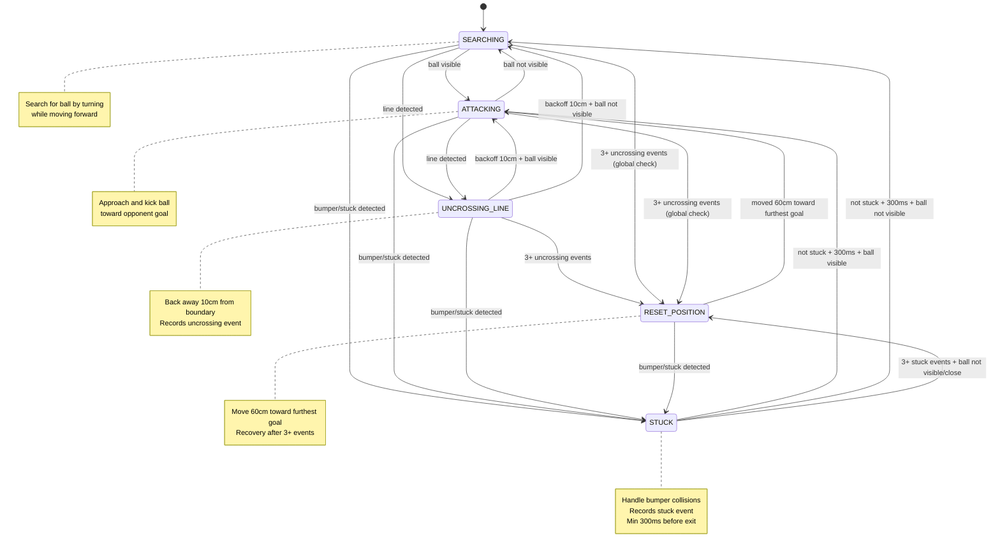
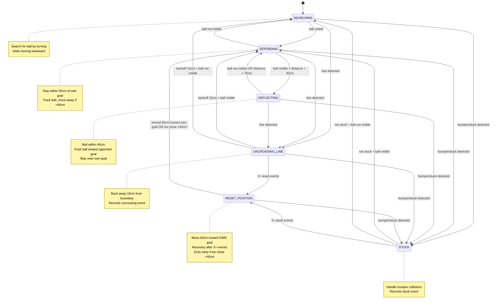

# State Transition Diagrams

## Attacker State Machine

## Defender State Machine

## State Descriptions

### Attacker States

- **SEARCHING**: Search for ball by turning while moving forward. Transitions to ATTACKING when ball is found.
- **ATTACKING**: Approach and kick the ball toward opponent goal. Transitions to SEARCHING when ball is lost.
- **UNCROSSING_LINE**: Back away 10cm from field boundary after line detection. Records 'uncrossing' event.
- **STUCK**: Handle bumper collisions and stuck situations. Records 'stuck' event. Requires 300ms minimum before exit.
- **RESET_POSITION**: Move 60cm toward furthest goal after 3+ stuck/uncrossing events. Used to recover from repeated failures.

### Defender States

- **SEARCHING**: Search for ball by turning while moving backward. Transitions to DEFENDING when ball is found.
- **DEFENDING**: Stay within 50cm of own goal, track ball. Move away if too close (<40cm). Transitions to DEFLECTING when ball is close (<40cm).
- **DEFLECTING**: Ball is within 40cm. Push ball toward opponent goal while staying near own goal. Exits when ball lost or >70cm away.
- **UNCROSSING_LINE**: Back away 10cm from field boundary after line detection. Records 'uncrossing' event.
- **STUCK**: Handle bumper collisions and stuck situations. Records 'stuck' event.
- **RESET_POSITION**: Move 60cm toward OWN goal after 3+ stuck/uncrossing events. Exits early if already too close (<40cm).

## Event Tracking

Both strategies track events in a 5-second window:
- **uncrossing**: Line crossing detected
- **stuck**: Bumper collision or stuck sensor triggered

After accumulating 3+ events within the window, the robot enters RESET_POSITION to recover.
